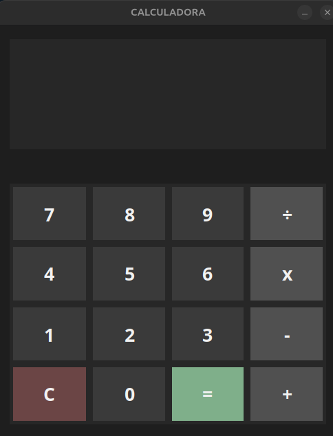

# Calculadora en Python

Mi primer proyectro completo desarollado con Python y Tkinter.

## Descripción

Calculadora gráfica para realizar operaciones básicas:
- Suma
- Resta
- Multiplicación
- División

Incluye manejo de división entre cero, limpieza de operaciones y una interfaz gráfica personalizada.

## Tecnologías

- Python
- Tkinter

## Lo que aprendí

Este proyecto me sirvió para aprender y practicar:
- Clases y métodos en Python
- Interfaces gráficas con Tkinter
- Manejo de eventos y botones
- Uso de funciones lambda
- Validación de errores
- Refactorización de código
- Estado interno de una aplicación

## Vista previa


## Ejecutar el proyecto

```bash
python3 main.py

>>>>>>> 3b25b8d (Añade captura y mejora README)
